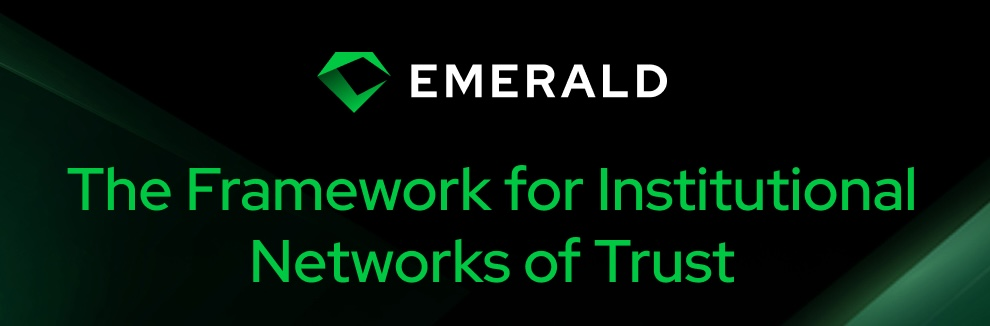

# Emerald



[![Telegram Chat][tg-badge]][tg-url]
[![Documentation][docs-main-image]][docs-main-link]
[](/LICENSE)

[docs-main-image]: https://img.shields.io/badge/docs-main-blue?logo=googledocs&logoColor=white
[docs-main-link]: https://emerald-docs.informalsystems.io
[tg-badge]: https://img.shields.io/badge/Emerald-Chat-blue?logo=telegram
[tg-url]: https://t.me/+uHIbcHYVbA44NzNh

Emerald is a modular framework for building decentralized networks of trust. 
Designed with simplicity at its core, it enables users to deploy reliable, easy to operate, high performance, EVM-compatible networks.

## Why Emerald 

Society runs on networks of trust: shared expectations and reputations that let us coordinate and innovate at scale.

Blockchains strengthen these networks with transparent rules and auditable operations. Bitcoin enabled global value transfer. Ethereum made trust programmable. But their large-scale governance makes it hard for institutions to define specific trust rules.

Emerald empowers institutions to build production-ready networks with tailored governance and compliance logic while retaining the reliability and interoperability of decentralized systems.

## Architecture

Emerald's architecture is intentionally clean and composable, consisting of four key components: 

- The [Malachite][malachite] consensus engine
- An Ethereum execution client (currently [Reth][reth])
- A lightweight shim layer that connects consensus and execution via [Engine API][engine-api]
- A proof-of-authority (PoA) module

This modular design keeps the system easy to understand, maintain, and extend while providing full EVM compatibility, predictable PoA consensus, and simple deployment and operation.

> TODO: link to doc with more info on the architecture, describing the four components

## Getting Started

> TODO: Do we want this here or we just point to the docs directly?

### Prerequisites

- [Rust toolchain](https://rust-lang.org/tools/install/) (use rustup for easiest setup)
- [Foundry](https://getfoundry.sh/introduction/installation/) (for compiling, testing, and deploying EVM smart contracts)
- Docker (optional, for local deployments)

> TODO: are there other prerequisites? 

### Installation

```bash
git clone https://github.com/informalsystems/emerald.git
cd emerald
make build
```

### Launching a Local Network

### Launching a Testnet

## Performance Evaluation

> TODO: how to run benchmarks

## Contributing

Contributions are welcome! Please open an issue or submit a PR. For large changes, we recommend discussing them in an issue first.

## Acknowledgements

Emerald is built on top of the work in [malaketh-layered], developed by Circle 
(see [here](https://github.com/informalsystems/emerald/compare/7d54fa6bdfca7857493367fd195813e569fd42e6...main) a complete list of changes). 
Their implementation provided a strong foundation for Emerald, and we are grateful for the contributions and engineering effort behind the project.

[malachite]: https://github.com/circlefin/malachite
[malaketh-layered]: https://github.com/circlefin/malaketh-layered/commit/7d54fa6bdfca7857493367fd195813e569fd42e6
[engine-api]: https://github.com/ethereum/execution-apis/tree/main/src/engine
[reth]: https://github.com/paradigmxyz/reth
