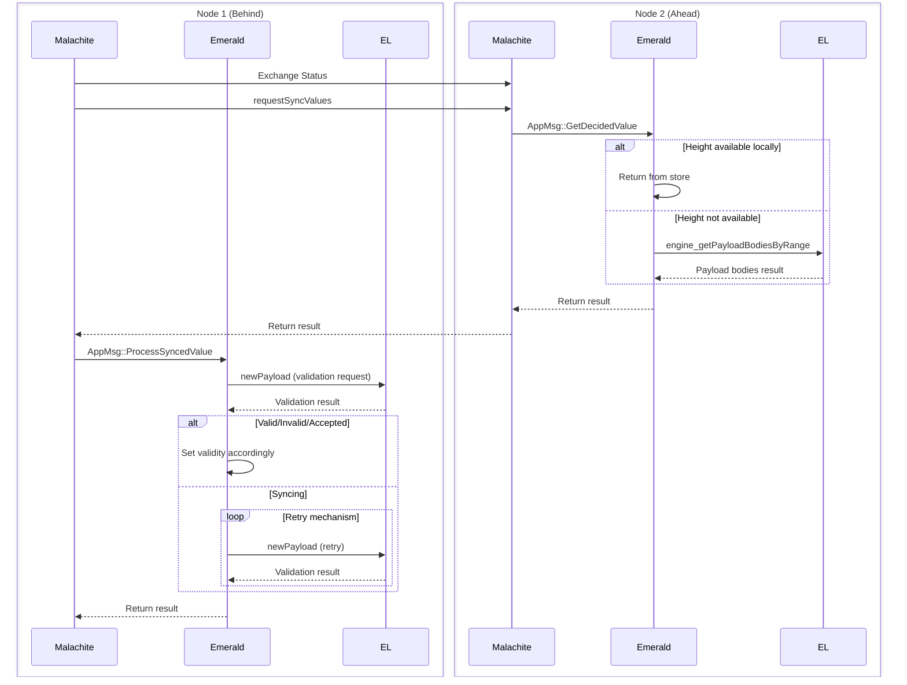

# Syncing

## Overview

### Reth Sync Overview

When a Reth node falls behind other Reth nodes while the consensus layer (CL) is not advancing, Reth continues to receive new blocks through the P2P networking layer (`crates/net/`). 
Other peers announce new blocks via `NewBlockHashes` and `NewBlock` messages, which Reth can then download and validate locally.

Reth waits for a command from the CL through Engine API method calls before advancing the canonical chain. 
This ensures that the execution layer (EL) remains synchronized with the CL decided values -- the CL is the authority on what's canonical. 

### Malachite Sync Overview

[ValueSync](https://github.com/informalsystems/malachite/tree/main/specs/synchronization) is a protocol that runs alongside consensus to help nodes catch up when they fall behind. 
It operates as a client-server system where each node runs both roles simultaneously.

**How it works**:

- **Height announcements** — Servers periodically broadcast their current consensus height to the network.
- **Gap detection** — Clients compare their local height against announced remote heights.
- **Request missing data** — When a client detects it's behind, it requests the missing height(s) from peers.
- **Serve from store** — The server retrieves the decided value and commit certificate from its local store and sends them back.
- **Deliver to consensus** — The client passes the synced data to the consensus layer, which processes it identically to data received through normal consensus operations.

When using Malachite's Channel API, ValueSync interacts with the application through two operations:

- `GetDecidedValue` — Malachite requests a previously decided value from the application's storage (used by the server to fulfill sync requests)
- `ProcessSyncedValue` — Malachite notifies the application that a value has been synced from the network (used by the client to deliver received data)

This design keeps syncing logic separate from consensus while reusing the same validation and commitment paths, i.e, a synced block goes through the same checks as a block decided in real-time.

### Emerald Sync Overview

## Sync Request Handling

The sync request contains the height, while the expected response includes the `value_bytes` and the commit `certificate`.

When the application (Emerald) receives the `AppMsg::GetDecidedValue` message, it processes it as follows:

1. Retrieve from storage the _earliest available height_, i.e., the minimum height for which the application can provide both the `value_bytes` and the commit `certificate`. 
   See the [Pruning](#pruning) section.
2. Validate the requested height range:
   - If the requested height is not available (i.e., below the earliest available height or above the latest decided height), return `None`.
   - Otherwise, continue.  
3. Retrieve from storage the _earliest unpruned height_, i.e., the minimum height for which the full block is available locally (no need to query the EL).
4. Fetch the block data:
    - If the requested height is below the earliest unpruned height, try fetching the missing block data from the EL using the Engine API method `engine_getPayloadBodiesByRange`. See the [EL Payload Retrieval](#el-payload-retrieval) section.
    - Otherwise, return the decided value directly from storage.

### EL Payload Retrieval

In order to provide a response to the `AppMsg::GetDecidedValue` message, the application requires both the `value_bytes` and the commit `certificate`.

In the current Emerald implementation, the `value_bytes` consist of an Ethereum payload. 
The payload bodies can be retrieved using the Engine API method `engine_getPayloadBodiesByRange`, which returns the transactions and withdrawals contained within a payload, but does not include the remaining metadata. 
Thus, the syncing protocol requires Emerald to store the block headers for the decided value.

An alternative approach would have been to use the `eth_getBlockByNumber` method and store `block_number` instead. However, since `engine_getPayloadBodiesByRange` was specifically designed for syncing purpose and allows for future batching optimizations, it was chosen instead.

### Pruning

The earliest available height is the minimum height for which the application can provide both the `value_bytes` and the commit `certificate`.
Since certificates are only stored in Emerald (the EL only stores payloads), the earliest available height corresponds to the certificate with the minimum height. 

> TODO: add docs on how Emerald is pruning its store (i.e., with or without certificates) and on the different type of Reth nodes

---

The minimal node height corresponds to the certificate with the lowest available height, since certificates are stored for all supported values.

Currently, there is no direct way to determine the oldest supported height by the execution client (Reth).

Depending on the node type, behavior differs:

- Archival Node - Reth stores all blocks from genesis. The minimal height can directly reflect this.
- Full Node - Reth stores approximately the last 10,064 blocks, pruning older ones. Logic could be added so that Malachite prunes in parallel with Reth.
- Custom Node - If Reth uses a custom pruning policy (defined in `reth.toml`), the middleware would need to either:
  - Follow the same custom pruning rules, or
  - Restrict itself to providing only data available locally.

> [!WARNING]
> In order for a node to be able to sync (from any height), there has to be at least one archival node in the network that can provide historical data. We plan to add snapshot syncing to remove this constraint.

## Sync Response Handling

> TODO: Ensure this is the correct way to handle ProcessSyncedValue. If not, open a different PR to fix the code and then update this section.

Upon receiving a response from a peer, Malachite is providing to the application (Emerald) the `height`, `round`, `proposer`, and `value_bytes` via the `AppMsg::ProcessSyncedValue` message. 
The application is processing it as follows:

1. Extract the payload from the value and then validate it using the Engine API method `engine_newPayload`.
   This validation ensures that the provided value is consistent with the EL rules before passing it back to Malachite.
2. Handle the payload validation responses:
    - If the EL returns a `SYNCING` status, the node retries validation.
    - The retry mechanism re-sends the validation request until the EL returns either `VALID` or `INVALID`.
    - After each `SYNCING` response, the application waits for a configurable sleep delay before retrying.

    This was added in order to ensure proper sync in scenarios where both CL and EL are recovering from a crash.

3. Return the reconstructed proposal to Malachite once validation succeeds.

> [!NOTE]
> In the current Malachite implementation, there is no timeout during validation of syncing values.
> A configurable syncing timeout has been introduced as part of the `EmeraldConfig` to address this.

## Example Flow

Consider a scenario where the entire node falls behind. In this case, 

- Reth will detect from its peers that it is lagging; 
- and Malachite will trigger its syncing protocol through status exchanges.

On the Malachite side, data needs to be retrieved from its application (i.e., Emerald with Reth as EL) to provide information to peers. 
When Emerald receives the `AppMsg::GetDecidedValue` message, several situations are possible:

1. Data is available locally in Emerald - this applies only for the last few heights (5).
2. Metadata is available, but the full decided value is missing - Emerald needs to query Reth for the missing data.
3. No data is available at all.

Suppose a situation where metadata is available, but the payloads for the corresponding block heights must be retrieved from Reth. 
In this case, the decided value is reconstructed and returned to Malachite, which then forwards it to the syncing peer.

When the peer receives the decided value, it must validate it via the `engine_newPayload` API call.
If Reth is still syncing and does not yet have the required data for validation, the call will return `PayloadStatus::SYNCING`.
In that case, Emerald will retry until the operation either succeeds or times out. 
Once Reth returns `Valid` or `Invalid`, the peer can proceed accordingly.
