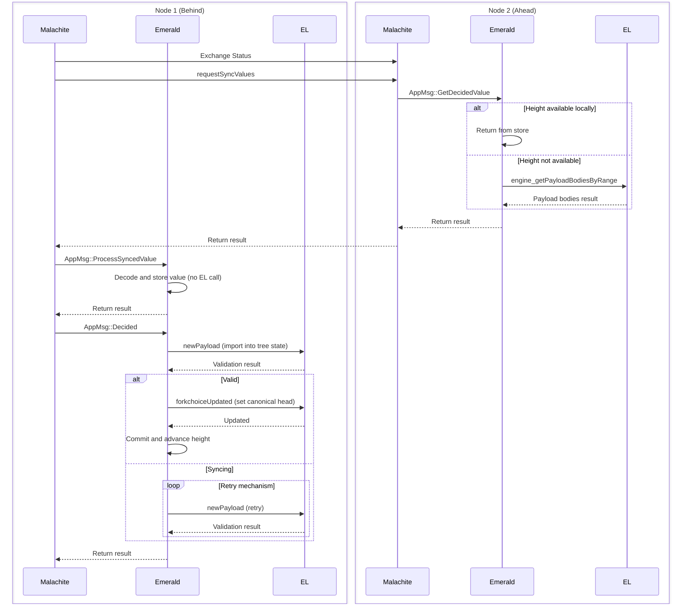

# Syncing

## Overview

### Malachite Sync Overview

[ValueSync](https://github.com/informalsystems/malachite/tree/main/specs/synchronization) is a protocol that runs alongside consensus to help nodes catch up when they fall behind. 
It operates as a client-server system where each node runs both roles simultaneously.

**How it works**:

- **Height announcements** — Servers periodically broadcast their current consensus height to the network.
- **Gap detection** — Clients compare their local height against announced remote heights.
- **Request missing data** — When a client detects it's behind, it requests the missing height(s) from peers.
- **Serve from store** — The server retrieves the decided value and commit certificate from its local store and sends them back.
- **Deliver to consensus** — The client passes the synced data to the consensus layer, which processes it identically to data received through normal consensus operations.

When using Malachite's Channel API, ValueSync interacts with the application through two operations:

- `GetDecidedValue` — Malachite requests a previously decided value from the application's storage (used by the server to fulfill sync requests)
- `ProcessSyncedValue` — Malachite notifies the application that a value has been synced from the network (used by the client to deliver received data)

This design keeps syncing logic separate from consensus while reusing the same validation and commitment paths, i.e, a synced block goes through the same checks as a block decided in real-time.

### Reth Sync Overview

Post-merge, Reth does not autonomously advance its canonical chain. It relies on the consensus layer (CL) to drive block import and chain head selection via the Engine API. Reth's P2P sync is purely reactive and on-demand:

- **`newPayload`** is the primary way blocks enter Reth. It validates and executes the payload, then inserts it into the in-memory block tree (`tree_state.blocks_by_hash`). If the parent is unknown, the block is **buffered** (not rejected) and automatically connected when the parent arrives.
- **`forkchoiceUpdated`** sets the canonical chain head. It requires the target block to already exist in the tree state (imported via `newPayload`). If the block is missing, Reth returns `SYNCING` and emits a `Download` event to fetch it from peers via P2P.
- **`getPayload`** only reads from Reth's in-memory `PayloadStore` (built payloads). It does **not** import blocks into the tree state.

Reth nodes are connected via P2P (explicit peering via `add_peers.sh` or `--trusted-peers`). When Reth detects missing blocks — either through a `forkchoiceUpdated` pointing to an unknown hash or through peer announcements (`NewBlockHashes`, `NewBlock`) — it downloads them from peers. However, it will not advance the canonical chain until the CL instructs it via `forkchoiceUpdated`. The CL is the authority on what's canonical.

In Emerald's architecture, `newPayload` is the optimal path for feeding blocks to Reth during sync: Emerald already has the full payload from Malachite's ValueSync, so importing it directly is faster and more reliable than waiting for Reth P2P download.

### Emerald Sync Overview

```mermaid
sequenceDiagram
    box Node 1 (Behind)
        participant M1 as Malachite
        participant E1 as Emerald
        participant EC1 as EL
    end
    box Node 2 (Ahead)
        participant M2 as Malachite
        participant E2 as Emerald
        participant EC2 as EL
    end

    M1->>M2: Exchange Status
    M1->>M2: requestSyncValues

    M2->>E2: AppMsg::GetDecidedValue

    alt Height available locally
        E2->>E2: Return from store
    else Height not available
        E2->>EC2: engine_getPayloadBodiesByRange
        EC2-->>E2: Payload bodies result
    end

    E2-->>M2: Return result
    M2-->>M1: Return result

    M1->>E1: AppMsg::ProcessSyncedValue
    E1->>E1: Decode and store value (no EL call)
    E1-->>M1: Return result

    M1->>E1: AppMsg::Decided
    E1->>EC1: newPayload (import into tree state)
    EC1-->>E1: Validation result

    alt Valid
        E1->>EC1: forkchoiceUpdated (set canonical head)
        EC1-->>E1: Updated
        E1->>E1: Commit and advance height
    else Syncing
        loop Retry mechanism
            E1->>EC1: newPayload (retry)
            EC1-->>E1: Validation result
        end
    end

    E1-->>M1: Return result
```

## Sync Request Handling

The sync request contains the height. The expected response includes the `value_bytes` and the commit `certificate`.

When Emerald receives `AppMsg::GetDecidedValue`, it processes it as follows:

1. Check if the requested height falls within the available range (`earliest_certificate_height..consensus_height`). If not, return `None`. See [Pruning](#pruning).
2. If the full block data is available locally (height >= earliest unpruned height), return it directly from storage.
3. Otherwise, reconstruct the payload from the locally stored block header and the block body fetched from the EL via `engine_getPayloadBodiesByRange`. If the EL cannot provide the body (pruned or unavailable), return `None`. See [EL Payload Retrieval](#el-payload-retrieval).

### EL Payload Retrieval

`engine_getPayloadBodiesByRange` returns only transactions and withdrawals — not the header fields (parent_hash, state_root, timestamp, etc.). To reconstruct a full payload, Emerald stores block headers (the payload with transactions and withdrawals stripped) at commit time. This keeps storage lightweight while allowing full payloads to be reconstructed on demand from header + EL body.

`eth_getBlockByNumber` could serve a similar purpose, but `getPayloadBodiesByRange` was chosen because it is purpose-built for sync. Currently it is called with a count of 1 (one block at a time), but it supports range queries for future batching.

### Pruning

Emerald prunes two categories of data independently:

- **Certificates + block headers**: retained for the last `num_certificates_to_retain` heights (default: unlimited). Pruned every `prune_at_block_interval` heights (default: 10). This defines the `earliest_certificate_height` — the lower bound for sync requests.
- **Block data** (decided values, undecided proposals, pending parts): retained for the last `num_temp_blocks_retained` heights (default: 10). This defines the `earliest_unpruned_height` — below this, block bodies must be fetched from the EL.

For heights where block data has been pruned but certificates remain, Emerald reconstructs the payload from the stored header + EL body (see [EL Payload Retrieval](#el-payload-retrieval)). If the EL has also pruned the block (depends on Reth's node type and pruning config), the sync request returns `None`.

> [!WARNING]
> In order for a node to be able to sync from any height, there has to be at least one archival node in the network that can provide historical data. We plan to add snapshot syncing to remove this constraint.

## Sync Response Handling

Upon receiving a response from a peer, Malachite provides the `height`, `round`, `proposer`, and `value_bytes` to the application (Emerald) via the `AppMsg::ProcessSyncedValue` message.
The application processes it as follows:

1. Decode the value from its wire format.
2. Store the block data as undecided so that it can be retrieved when the `Decided` message arrives.
3. Return the decoded value to Malachite without calling the EL.

No `newPayload` call is made during this step. Malachite has already verified the commit certificate, proving that 2/3+ of the validator set accepted this value, so EL validation is redundant.

The `newPayload` call is deferred to the `Decided` handler, where it is required to import the block into Reth's tree state before `forkchoiceUpdated` can set it as canonical head. If Reth returns `SYNCING` (e.g., because the parent block is not yet available), the retry mechanism re-sends the request until Reth returns `VALID` or `INVALID`.

## Example Flow

Consider a scenario where the entire node falls behind. In this case, 

- Reth will detect from its peers that it is lagging; 
- and Malachite will trigger its syncing protocol through status exchanges.

On the Malachite side, data needs to be retrieved from its application (i.e., Emerald with Reth as EL) to provide information to peers. 
When Emerald receives the `AppMsg::GetDecidedValue` message, several situations are possible:

1. Data is available locally in Emerald - this applies only for the last few heights (5).
2. Metadata is available, but the full decided value is missing - Emerald needs to query Reth for the missing data.
3. No data is available at all.

Suppose a situation where metadata is available, but the payloads for the corresponding block heights must be retrieved from Reth. 
In this case, the decided value is reconstructed and returned to Malachite, which then forwards it to the syncing peer.

When the peer receives the decided value, it stores it locally without calling the EL (the certificate already proves validity).
When the `Decided` message arrives, Emerald calls `engine_newPayload` to import the block into Reth's tree state, followed by `forkchoiceUpdated` to set it as canonical head.
If Reth is still syncing and does not yet have the parent block, the `newPayload` call will return `PayloadStatus::SYNCING`.
In that case, Emerald will retry until the operation either succeeds or times out.
