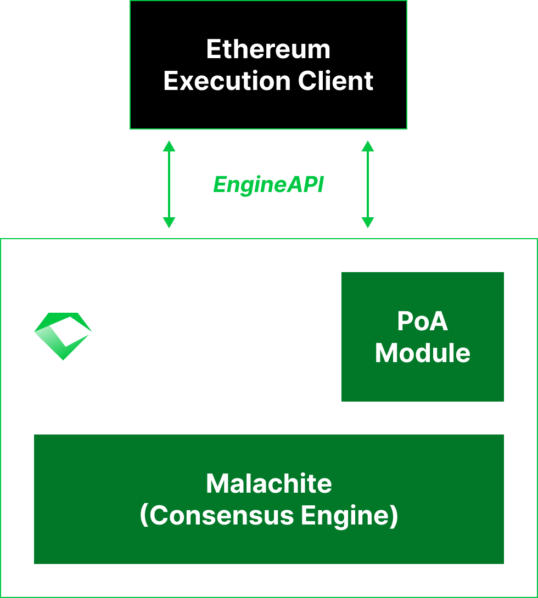

# Introducing Emerald

Emerald is an open-source, modular framework for deploying reliable, easy to operate, high performance, EVM-compatible networks. 

## The Case for Emerald

Society runs on networks of trust: shared expectations and reputations that let us coordinate and innovate at scale.

Blockchains strengthen these networks with transparent rules and auditable operations. 
Bitcoin enabled global value transfer. Ethereum made trust programmable. 
But their large-scale governance makes it hard for institutions to define specific trust rules.

Emerald empowers institutions to build networks of trust with tailored governance and compliance logic 
while retaining the reliability and interoperability of decentralized systems.

## Main Components

Emerald's architecture is intentionally clean and composable, consisting of three key components: 

- The [Malachite](https://github.com/circlefin/malachite) consensus engine
- An Ethereum execution client (currently [Reth](https://github.com/paradigmxyz/reth)) integrated via [Engine API](https://github.com/ethereum/execution-apis/tree/main/src/engine)
- A proof-of-authority (PoA) module

For more details, please refer to the [Architecture](./architecture/index.md) section.

  
    

## Key Features

Emerald's modular design keeps the system easy to understand, maintain, and extend while providing full EVM compatibility, instant finality, predictable performance, and simple deployment and operation.

- **EVM Compatibility.** Full EVM compatibility enables seamless integration with existing developer workflows, libraries, and infrastructure, making it easy to build, deploy, and maintain applications.
  It also means Emerald networks can tap directly into Ethereum’s thriving DeFi landscape and the wide range of applications already built for it, including bridges, explorers, indexers, and interoperability protocols.
- **Instant Finality.** Emerald leverages [Malachite](https://github.com/circlefin/malachite) as its consensus engine. 
  As a high-performance implementation of the [Tendermint](https://arxiv.org/abs/1807.04938) Byzantine Fault Tolerant (BFT) protocol, Malachite provides _single-slot finality_, meaning that transactions are finalized immediately once a block is committed.
- **Predictable Performance.** Emerald's PoA-based model not only fits naturally with institutional networks of trust (where participants are well-known organizations that can use their reputations as stake), but it enables predictable performance. With a fixed, accountable validator set and instant finality consensus, block times remain stable, latency is low, and throughput is consistent.
- **Simple Deployment and Operation.** Emerald is built on battle-tested technology: Malachite is a formally specified Tendermint consensus implementation and Reth is a high-performance Ethereum execution client. 
  In addition, Emerald comes with a state-of-the-art [runbook on how to operate a production network](../production-network/index.md). 

## Use Cases

Building on Emerald simplifies development through full EVM compatibility that provides access to established Ethereum tooling, libraries, and workflows. 
Teams can quickly create powerful applications by leveraging existing components like DeFi protocols, bridges, and token standards that work natively on Emerald without modification. 

With this foundation, Emerald serves institutional adoption through applications organizations increasingly prioritize:

- Real-world asset tokenization systems requiring transparent governance.
- Cross-border payment networks needing predictable performance.
- Trading platforms reliant on verifiable execution.

These applications are already being built on Emerald today, including RWA platforms, decentralized exchanges, and payment networks.

## Contributing & Support

Emerald is developed by [Informal Systems](https://informal.systems). For questions, issues, or contributions, please visit the [Emerald GitHub Repository](https://github.com/informalsystems/emerald).