# Performance evaluation

While building Emerald we have put an emphasis on performance testing with the goal of understanding its limits. 
While tuning the execution client and the Malachite consensus engine is very application dependant, 
the goal is to get a best-case baseline to understand any potential overhead introduced by applications built on top of Emerald. 

## Malachite

Emerald is built on top of Malachite, a high performant version of the Tendermint consensus algorithm.  
To understand the overhead of running with an execution client, we first benchmark Malachite without Reth. 

We run a simple channel-based application on top of Malachite. The application only generates blocks of a certain size,  
and forwards them to peers for voting. 
As Malachite does not support variable block sizes in its channel based example app, we added this functionality to [our own fork](https://github.com/informalsystems/malachite/pull/6).

### Setup

- Block size: 1KiB, 1MiB, 2MiB
- Deployments: single datacenter and geo-distributed
- Number of nodes: 4, 8, 10
- Hardware setup: 8GB RAM, 4CPUs Digital Ocean droplets

> TODO we need more details on HW setup

### Results

<div style="text-align: left;">  
    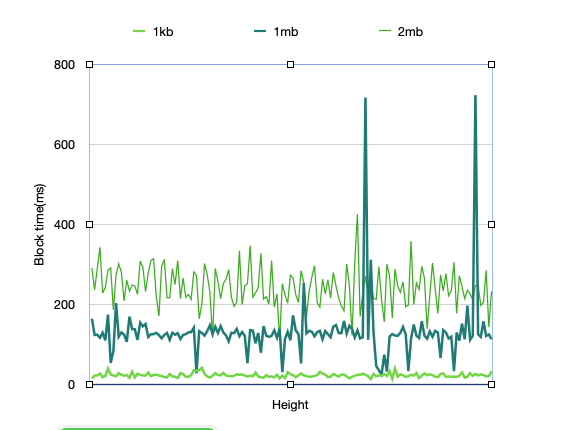 <br/>
    <p class="caption">Single datacenter deployment on 4 nodes, with a varying block size. The average block time is 133 ms for 1MB blocks.</p>
</div>

> TODO: it's not clear for which block size is the 133ms average (DONE)

<div style="text-align: left;">  
    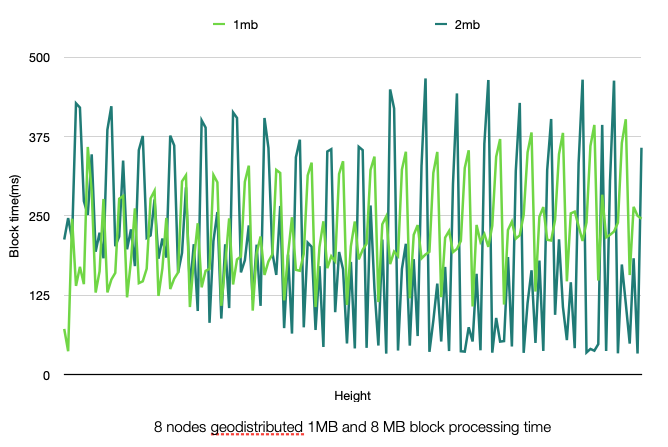  
    <p class="caption">Geo-distributed deployment on 8 nodes, with each 2 nodes in a different datacenter (NYC, LON, AMS, SFO).
    The geo-distribution impacts performance, with spikes in block times. The time for 1MB blocks varies around 230ms but has spikes above 300ms. </p>
</div>

> TODO: the spikes seem higher thant 260ms (DONE)

<div style="text-align: left;">   
    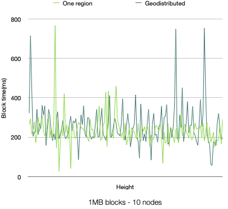
    <p class="caption"> Deployment on 10 nodes, both in a single datacenter and geo-distributed, with 1MiB blocks.  
    No significant difference from running on 8 nodes.</p>
</div>

Although the channel-based application deployed on Malachite doesn't have a concept of transactions, 
we can consider “native” Ethereum EOA-to-EOA transfers (i.e., plain ETH sends), which have ~110bytes. 
In this context, 
- a single datacenter deployment on 4 nodes with 1MiB blocks and average block time of 133ms results in around **68k TPS** 
- a geo-distributed deployment on 8 nodes with 1MiB blocks and average block time of 250ms results in around **36k TPS**.

> TODO: review the estimates for TPS. are the average block times accurate? 
> - 1,000,000 bytes / 110 bytes ~ 9,090 tx per block
> - 9,090 / 0.133 ~ 68,346 TPS
> - 9,090 ÷ 0.25 ~ 36,360 TPS

## Emerald

### Configuration

For optimal performance, it is important to tune the execution engine according to application requirements. 

The goal here is to push the system to achieve high throughput, while keeping it stable. 
By stable we mean handling incoming transactions without filling up the mempool, 
building blocks fast enough to keep up with consensus and sending data within the network to avoid congestion at the RPC level. 

We use the following changes to the default [Reth node configuration](https://reth.rs/cli/reth/node#reth-node):
```yaml
    "--txpool.pending-max-count=50000",
    "--txpool.pending-max-size=500",
    "--txpool.queued-max-count=50000",
    "--txpool.queued-max-size=500",
    "--txpool.basefee-max-count=50000",
    "--txpool.basefee-max-size=500",
    "--txpool.max-account-slots=100000",
    "--txpool.max-batch-size=10000",
    "--txpool.minimal-protocol-fee=0",
    "--txpool.minimum-priority-fee=0",
    "--txpool.max-pending-txns=20000",
    "--txpool.max-new-txns=20000",
    "--txpool.max-new-pending-txs-notifications=20000",
    "--max-tx-reqs=10000",
    "--max-tx-reqs-peer=255",
    "--max-pending-imports=10000",
    "--builder.gaslimit=1000000000",
```
> TODO: confirm these are indeed all changes (DONE)

> TODO: confirm gaslimit 1_000_000_000 vs 100_000_000. It should be 100_000_000 (in my runs it was as stated above) (DONE)
 
For your particular setup this might be suboptimal.
These flags allow a very high influx of transactions from one source.
They are buffering up to 50000 transactions in the mempool, and gossip them in big batches.
We also increased the buffer for pending tx notifications to 20000 (from the default of 200). 

As transactions, we use “native” Ethereum EOA-to-EOA transfers (i.e., plain ETH sends). 
A set of spamming nodes are injecting transactions signed by different accounts. 
Every spammer is sending transactions to one single Reth node. 

### Cloud-Based Deployment

#### Setup

- Deployments: single datacenter and geo-distributed
- Number of nodes: 4, 8
- Hardware setup: Digital Ocean nodes, 64GB RAM, 16 shared CPU threads, with regular SSDs

#### Results: 4-node deployment - single data center

Transactions are sent to all nodes in parallel, at a rate of 8000txs/sec per node.

We observe a throughput of 8000tx/sec with block sizes of 0.5-1MiB. The reported block time is averaging 220ms with spikes up to 230ms. 

> TODO: how is the block time 230ms and consensus 620ms?  (DONE this was from previous runs)

<div style="text-align: left;">  
     <br/>
    <p class="caption">Single datacenter deployment on 4 nodes, with a load of 8000 tx/s. Average block time of 230ms.</p>
</div>

<div style="text-align: left;">  
    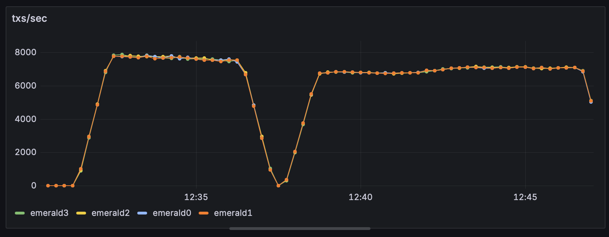 <br/>
    <p class="caption">Single datacenter deployment on 4 nodes. 8000tx/sec sustained.</p>
</div>

When injecting at once 8000 transactions via RPC we noticed a lot of disconnects.
Thus, we split it in multiple RPC requests. 
In the first half of the above figure, we send 1600 transactions every `200ms`. 
In the second half, we send RPC requests every `100ms`, which results in a slight decrease in sustained TPS. 

<div style="text-align: left;">  
    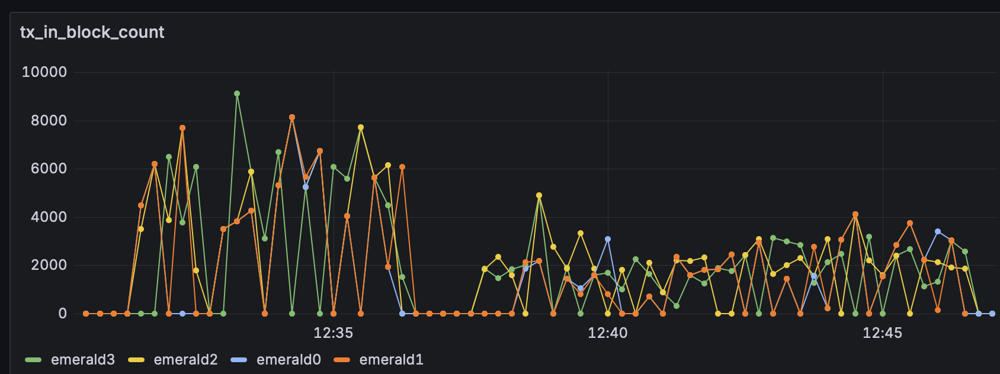 <br/>
    <p class="caption">Single datacenter deployment on 4 nodes. Number of transactions in block.</p>
</div>

The graph below shows the average block size accross the run , where each block consumes ~1MB.

#### Results: 8-node deployment - geo-distributed

In this setting, we distributed the nodes between different datacenters, where two nodes were placed in each of the following datacenters: New York, SanFrancisco, Amsterdan and London. 

The system also sustained an influx of 8000 transactions per second, but it could not process more than 6000 transactions /second overall. 

<div style="text-align: left;">  
    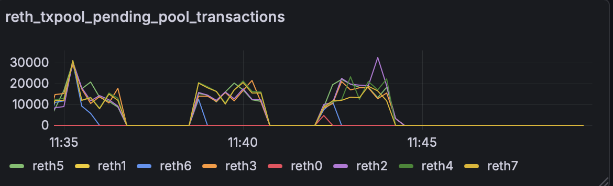 <br/>
    <p class="caption"> Number of pending transactions in the mempool of Reth. </p>
</div>

The graph above shows that some nodes have fewer transactions in their pool, thus proposing smaller blocks. 


For this setup to be able to sustain more than 3000 transactions per second of incoming transactions, we lowered the interval between sending batches of transactions (from `200ms` to `100ms`). Thus we had more freuqent batches of smaller transactions. 

Another thing we observed is that, having the nodes fully connected improved performance. The performance was less impacted by Reth nodes having fewer peers than when consensus nodes did not have connections to all the peers.


<div style="text-align: left;">  
    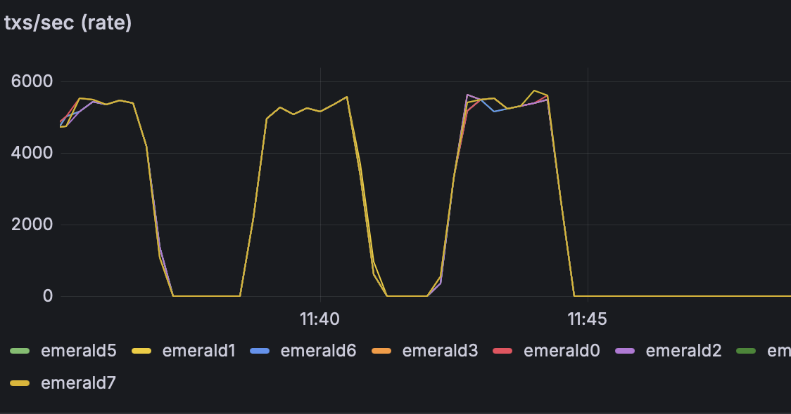 <br/>
    <p class="caption"> Throughput of up to 5800tps when running on a 8 node network distributed in 4 data centers (NYC, SFO, AMS, LON). </p>
</div>

<div style="text-align: left;">  
    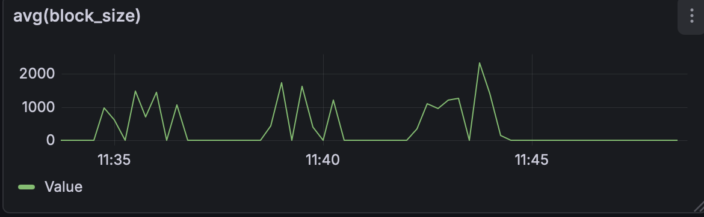 <br/>
    <p class="caption"> Block size when running on a 8 node network distributed in 4 data centers (NYC, SFO, AMS, LON). </p>
</div>

<div style="text-align: left;">  
    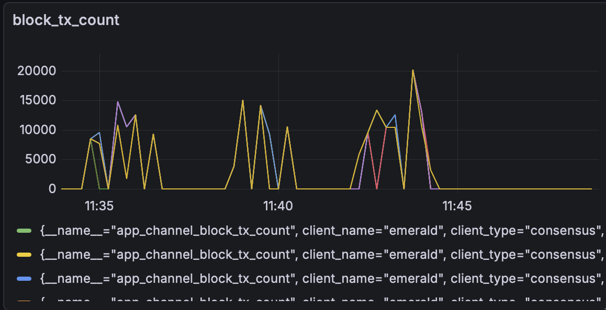 <br/>
    <p class="caption"> Number of transactions in a block when running on a 8 node network distributed in 4 data centers (NYC, SFO, AMS, LON). </p>
</div>


<div style="text-align: left;">  
    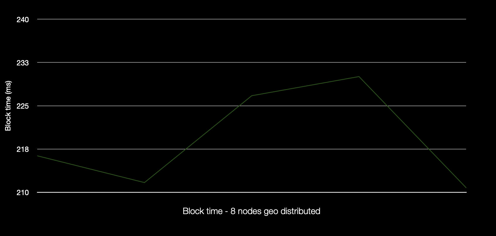 <br/>
    <p class="caption"> Block time when running on a 8 node network distributed in 4 data centers (NYC, SFO, AMS, LON). </p>
</div>


### Bare-Metal Deployment

These experiments evaluate Emerald on 4 bare-metal machines in a local and geo-distributed setup. 
The goal is to understand the absolute best performance the chain can have.

The server configuration is as follows:

32Gb RAM; 
CPU: AMD EPYC 4584PX;
Micron 7500 1TB NVMe

We spam each node with a load of 8000tx/sec with the same Reth configuration as above. Emerald reaches a peek throughput of 9200 tx/sec with overall 8300 tps sustained throughput throughout the run.  Block size was between 1 and 1.5MB. 
The reported block time was between 170ms to 230ms compared to an average of 133ms for Malachite core for 1MB blocks. 

<div style="text-align: left;">  
    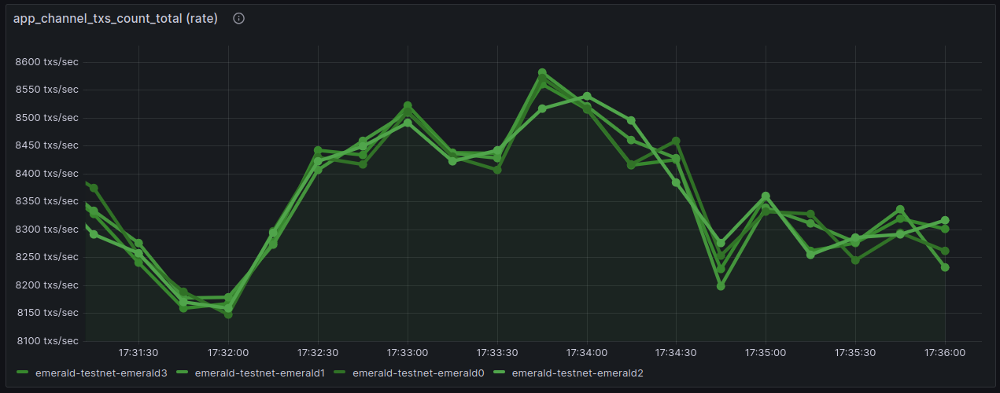 <br/>
    <p class="caption"> Throughput of up to 9200tps when running Emerald on 4 nodes within a datacenter. </p>
</div>

<div style="text-align: left;">  
    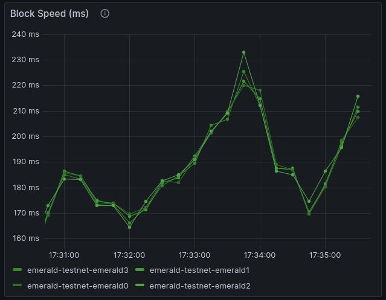 <br/>
    <p class="caption"> Block speed when running Emerald on 4 nodes within a datacenter. </p>
</div>

> TODO add more details about the deployment and the data (DONE)

