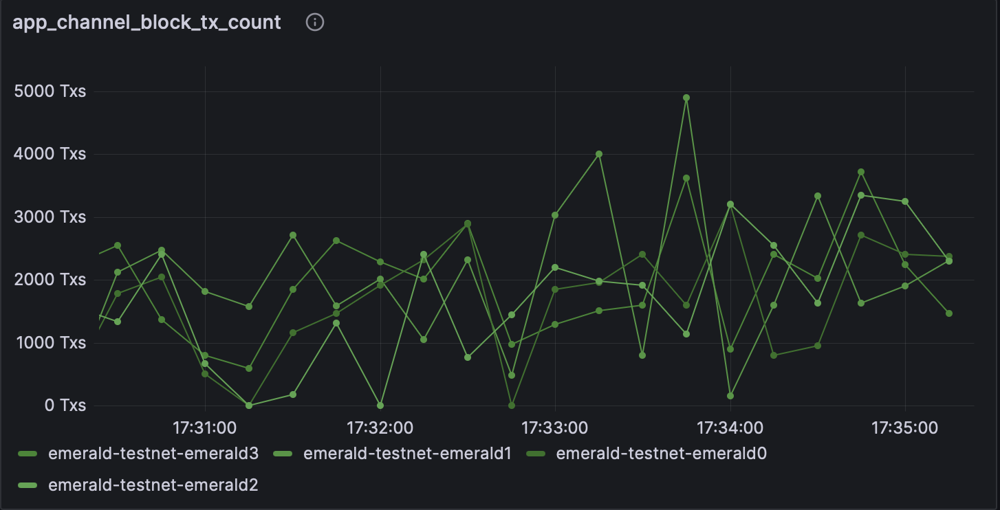

# Performance evaluation

While building Emerald we have put an emphasis on performance testing with the goal of understanding its limits. 
While tuning the execution client and the Malachite consensus engine is very application dependant, 
the goal is to get a best-case baseline to understand any potential overhead introduced by applications built on top of Emerald. 

## Malachite

Emerald is built on top of Malachite, a high performant version of the Tendermint consensus algorithm.  
To understand the overhead of running with an execution client, we first benchmark Malachite without Reth. 

We run a simple channel-based application on top of Malachite. The application only generates blocks of a certain size,  
and forwards them to peers for voting. 
As Malachite does not support variable block sizes in its channel based example app, we added this functionality to [our own fork](https://github.com/informalsystems/malachite/pull/6).

### Setup

- Block size: 1KiB, 1MiB, 2MiB
- Deployments: single datacenter and geo-distributed
- Number of nodes: 4, 8, 10
- Hardware setup: 8GB RAM, 4CPUs Digital Ocean droplets

> TODO we need more details on HW setup

### Results

<div style="text-align: left;">  
     <br/>
    <p class="caption">Single datacenter deployment on 4 nodes, with a varying block size. The average block time for 1MiB blocks is 133 ms.</p>
</div>

<div style="text-align: left;">  
      
    <p class="caption">Geo-distributed deployment on 8 nodes, with each 2 nodes in a different datacenter (NYC, LON, AMS, SFO).
    The geo-distribution impacts performance, with spikes in block times. The time for 1MiB blocks varies around 230ms, but has spikes above 300ms. </p>
</div>

<div style="text-align: left;">   
    
    <p class="caption"> Deployment on 10 nodes, both in a single datacenter and geo-distributed, with 1MiB blocks.  
    No significant difference from running on 8 nodes.</p>
</div>

Although the channel-based application deployed on Malachite doesn't have a concept of transactions, 
we can consider “native” Ethereum EOA-to-EOA transfers (i.e., plain ETH sends), which have ~110bytes. 
In this context, 
- a single datacenter deployment on 4 nodes with 1MiB blocks and average block time of 133ms results in around **71700 TPS** 
- a geo-distributed deployment on 8 nodes with 1MiB blocks and average block time of 230ms results in around **41400 TPS**.

## Emerald

### Configuration

For optimal performance, it is important to tune the execution engine according to application requirements. 

The goal here is to push the system to achieve high throughput, while keeping it stable. 
By stable we mean handling incoming transactions without filling up the mempool, 
building blocks fast enough to keep up with consensus and sending data within the network to avoid congestion at the RPC level. 

We use the following changes to the default [Reth node configuration](https://reth.rs/cli/reth/node#reth-node):
```yaml
    "--txpool.pending-max-count=50000",
    "--txpool.pending-max-size=500",
    "--txpool.queued-max-count=50000",
    "--txpool.queued-max-size=500",
    "--txpool.basefee-max-count=50000",
    "--txpool.basefee-max-size=500",
    "--txpool.max-account-slots=100000",
    "--txpool.max-batch-size=10000",
    "--txpool.minimal-protocol-fee=0",
    "--txpool.minimum-priority-fee=0",
    "--txpool.max-pending-txns=20000",
    "--txpool.max-new-txns=20000",
    "--txpool.max-new-pending-txs-notifications=20000",
    "--max-tx-reqs=10000",
    "--max-tx-reqs-peer=255",
    "--max-pending-imports=10000",
    "--builder.gaslimit=1000000000",
```

> TODO: cloud deployments with gaslimit 1_000_000_000 vs bare metal with 200_000_000
 
For your particular setup this might be suboptimal.
These flags allow a very high influx of transactions from one source.
They are buffering up to 50000 transactions in the mempool, and gossip them in big batches.
We also increased the buffer for pending tx notifications to 20000 (from the default of 200). 

As transactions, we use “native” Ethereum EOA-to-EOA transfers (i.e., plain ETH sends). 
A set of spamming nodes are injecting transactions signed by different accounts. 
Every spammer is sending transactions to one single Reth node. 

### Cloud-Based Deployment

#### Setup

- Deployments: single datacenter on 4 nodes and geo-distributed on 8 nodes
- Hardware setup: Digital Ocean nodes, 64GB RAM, 16 shared CPU threads, with regular SSDs

#### Results

**Single datacenter deployment, 4 nodes.**
For a single datacenter deployments on 4 nodes, with block sizes of 0.5MiB to 1MiB, we observed a throughput of around **8000 TPS** sustained. 
The reported block time is averaging at **220ms** with spikes up to 230ms.

<div style="text-align: left;">  
     <br/>
    <p class="caption">Single datacenter deployment on 4 nodes. Average block time of 230ms.</p>
</div>

<div style="text-align: left;">  
     <br/>
    <p class="caption">Single datacenter deployment on 4 nodes. 8000 TPS sustained.</p>
</div>

Note that when injecting a higher number of transactions into a node, we observed instabilities most likely on the RPC side.
Thus, we split the injection into multiple RPC requests. Sending batches every 200ms leads to 8000 TPS sustained.
Sending more frequently, every 100ms, results in a drop of performance. 

<div style="text-align: left;">  
     <br/>
    <p class="caption">Single datacenter deployment on 4 nodes. Number of transactions per block.</p>
</div>


**Geo-distributed deployment, 8 nodes.**
For a geo-distributed deployment on 8 nodes, with two nodes placed in each datacenters (NYC, LON, AMS, SFO), we observed a throughput of around **5800 TPS** sustained. 

> TODO: mention the average block time


<div style="text-align: left;">  
     <br/>
    <p class="caption"> Number of pending transactions in the mempool of Reth. </p>
</div>

The graph above shows that some nodes have fewer transactions in their pool, thus proposing smaller blocks. 

For this setup to be able to sustain more than 3000 transactions per second of incoming transactions, we lowered the interval between sending batches of transactions (from `200ms` to `100ms`). Thus we had more freuqent batches of smaller transactions. 

Another thing we observed is that, having the nodes fully connected improved performance. The performance was less impacted by Reth nodes having fewer peers than when consensus nodes did not have connections to all the peers.

> TODO: not sure we need the above figure 


<div style="text-align: left;">  
     <br/>
    <p class="caption">Geo-distributed deployment on 8 nodes. 5800 TPS. </p>
</div>

<!-- <div style="text-align: left;">  
     <br/>
    <p class="caption">Geo-distributed deployment on 8 nodes. Block size. </p>
</div> -->

<div style="text-align: left;">  
     <br/>
    <p class="caption">Geo-distributed deployment on 8 nodes. Number of transactions per block.</p>
</div>

<div style="text-align: left;">  
     <br/>
    <p class="caption">Geo-distributed deployment on 8 nodes.Average block time of TBA. </p>
</div>

> TODO: add block time in the above caption

### Bare-Metal Deployment

#### Setup 

- Deployments: single datacenter on 4 bare-metal nodes
- Hardware setup: 32Gb RAM, AMD EPYC 4584PX CPU, Micron 7500 1TB NVMe

These experiments evaluate Emerald on 4 bare-metal machines in a local and geo-distributed setup. 
The goal is to understand the absolute best performance the chain can have.

#### Results

We observed a throughput of around **9200 TPS** peak and **8300 TPS** sustained. 
The reported block time was between 170ms to 230ms.

<div style="text-align: left;">  
     <br/>
    <p class="caption">Bare-metal deployment in a single datacenter deployment on 4 nodes. **8300 TPS** sustained.</p>
</div>

<div style="text-align: left;">  
     <br/>
    <p class="caption">Bare-metal deployment in a single datacenter deployment on 4 nodes. Block time between 170ms and 230ms.</p>
</div>

<div style="text-align: left;">  
     <br/>
    <p class="caption">Bare-metal deployment in a single datacenter deployment on 4 nodes. Number of transactions per block.</p>
</div>

