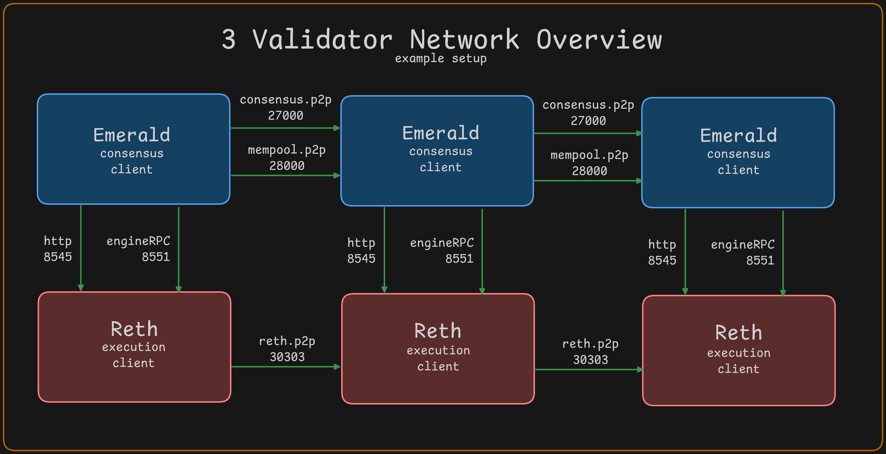

# Network Overview

Required nodes to run for operations:

- Reth - execution client
- Emerald - consensus client

These two services will need to communicate with eachother and with other nodes in the network. Note: for best performance they should be on the same server.

